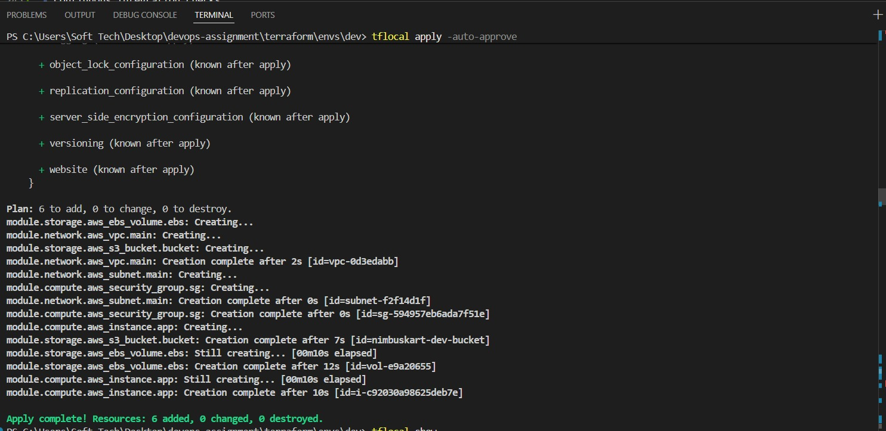
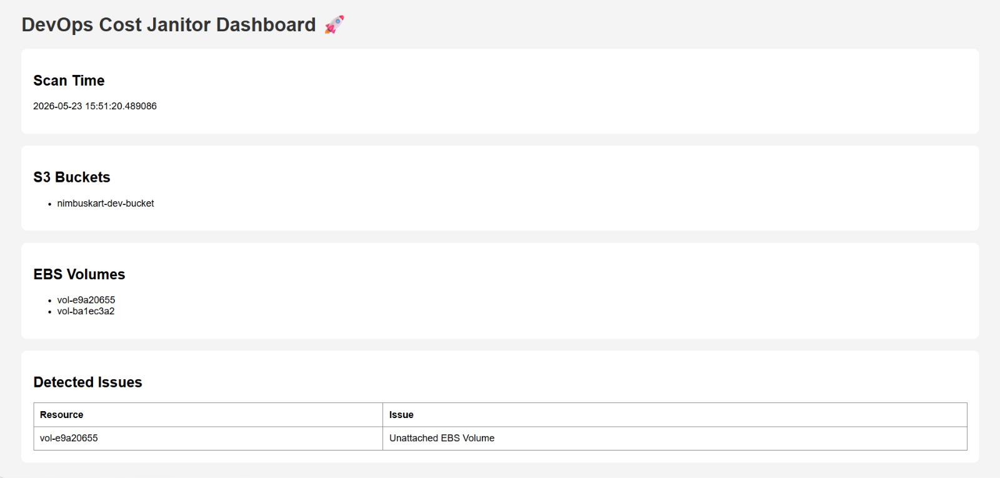
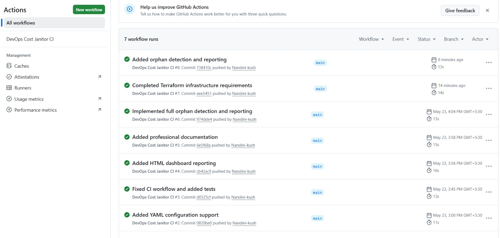
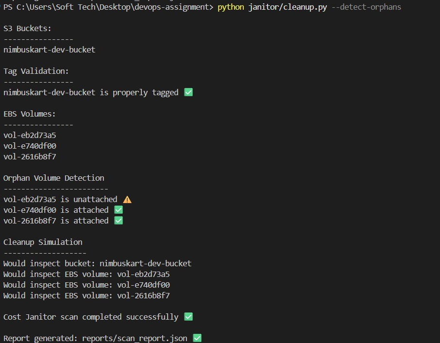

# DevOps Cost Janitor 🚀

An automated DevOps cloud governance and cost optimization tool built using Terraform, Python, Docker, LocalStack, and GitHub Actions.

This project simulates AWS infrastructure locally using LocalStack and performs automated cloud resource analysis, governance checks, orphan detection, and reporting.

---

# Technologies Used

- Terraform
- Python
- Docker
- LocalStack
- GitHub Actions
- YAML
- boto3

---

# Features

## Infrastructure as Code (IaC)

Provision AWS infrastructure using Terraform modules:

- VPC
- Subnets
- EC2 Instances
- Security Groups
- S3 Buckets
- EBS Volumes

---

## AWS Resource Scanning

The Python Janitor scans cloud resources and performs:

- S3 bucket detection
- EBS volume detection
- Infrastructure analysis

---

## Governance Checks

Validate mandatory resource tags:

- Project
- Environment
- Owner
- ManagedBy

Detect missing governance tags automatically.

---

## Cost Optimization

Detect potentially wasteful cloud resources:

- Unattached EBS volumes
- Unused infrastructure simulation
- Cleanup workflow simulation

---

## Reporting

Generate automated reports:

- JSON reports
- HTML dashboard
- Infrastructure summaries
- Orphan detection summaries

---

# Architecture Flow

Terraform → LocalStack → AWS Resource Simulation → Python Janitor Scanner → JSON Reports → HTML Dashboard → GitHub Actions CI/CD

---

# Project Structure

```bash
devops-assignment/
│
├── terraform/
│   ├── modules/
│   │   ├── network/
│   │   ├── compute/
│   │   └── storage/
│   │
│   └── envs/
│       └── dev/
│
├── janitor/
│
├── reports/
│
├── logs/
│
├── config/
│
├── .github/
│   └── workflows/
│
└── README.md
```

---

# Requirements

- Python 3.11+
- Terraform
- Docker Desktop
- LocalStack
- Git

---

# Setup Instructions

## Clone Repository

```bash
git clone YOUR_GITHUB_REPO_URL
```

---

## Install Python Dependencies

```bash
pip install boto3 colorama pyyaml
```

---

## Start Docker

Open Docker Desktop and ensure Docker Engine is running.

---

## Start LocalStack

```bash
docker run --rm -d -p 4566:4566 --name localstack localstack/localstack/localstack-lite
```

---

# Terraform Commands

## Initialize Terraform

```bash
tflocal init
```

---

## Validate Terraform

```bash
tflocal validate
```

---

## Plan Infrastructure

```bash
tflocal plan
```

---

## Apply Infrastructure

```bash
tflocal apply -auto-approve
```

---

# Python Janitor Commands

## Report Only Mode

```bash
python janitor/cleanup.py --report-only
```

---

## Detect Orphan Resources

```bash
python janitor/cleanup.py --detect-orphans
```

---

## Dry Run Mode

```bash
python janitor/cleanup.py --dry-run
```

---

## Generate Dashboard

```bash
python janitor/dashboard.py
```

---

# Dashboard Preview

The HTML dashboard provides:

- S3 bucket summaries
- EBS volume summaries
- Orphan detection
- Infrastructure scan reports
- Cost optimization insights

---

# CI/CD Workflow

GitHub Actions automatically performs:

- Terraform formatting validation
- Python syntax validation
- Automated testing
- Continuous Integration checks

---

# Screenshots

## Terraform Apply



---

## Dashboard Report



---

## GitHub Actions Workflow



---

## Orphan Detection Output


---

# Future Improvements

- Slack alerts
- Email notifications
- Automated cleanup
- Multi-region support
- Advanced analytics
- Scheduled scans

---

# Author

Nandini Kushwah

---

This project demonstrates practical DevOps automation, Infrastructure as Code (IaC), cloud governance, cost optimization, and CI/CD pipeline implementation using modern DevOps tooling.
